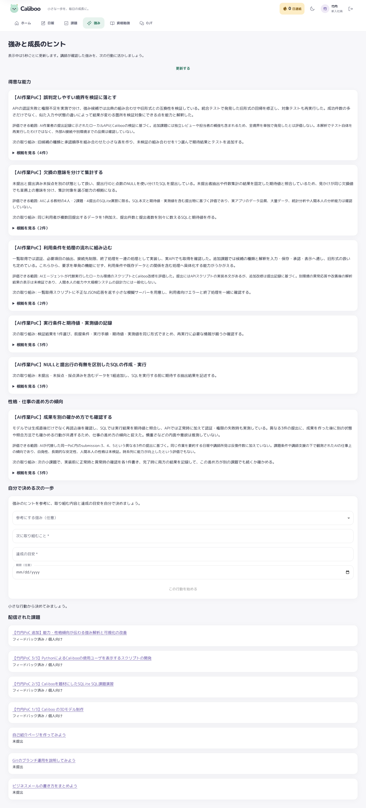

# 能力・性格傾向としての強み可視化 PoC

追加課題の実装・日報・3視点レビュー・Fan-in・独立解析・AI講師確認・本人表示まで完了した。新たに能力3件と仕事の傾向1件を承認し、[強み画面](http://localhost:5173/strengths)と[ホーム](http://localhost:5173/home)へ反映した。

## 変更した内容

初回の強みが実施した作業の見出しになっていたため、竹内への追加課題7として解析結果と表示を改善した。強みを「得意な能力」と「性格・仕事の進め方の傾向」に分け、判断理由・評価できる範囲・次の取り組みを表示する。原文の根拠はカード内で開閉できる。

能力と傾向を同じスキル領域で併存させ、旧形式の候補も保持する。傾向には異なる2件以上の本人記録を必要とし、講師コメントだけや同一記録の重複を数えない。[仕様](strength-profile.md)と[初回の成果](poc-takeuchi-2026-09-29.md)を参照。

## 実作業からの運用フロー

1. 別々の作業エージェントがバックエンドと画面を実装し、親エージェントが仕様・解析指示・最新mainとの統合を担当した。
2. 独立レビューの指摘を受け、講師所見を本人記録と誤認しないケースと、異なる種類の候補を置換しないケースをテストで補強した。
3. 実際の実装内容・検証結果・未確認事項を課題7へ提出した（提出ID6）。
4. 作業記録から日報を生成し、竹内アカウントで `rpt_20260929_7` を提出した。
5. 管理職・講師・シニアエンジニアの3エージェントが同じ日報のみを独立にレビューした。サーバーのFan-in関数で原文と保留事項を集約し、別の講師エージェントが要約した。
6. 3視点の原文・Fan-in要約を講師フィードバックとして登録した。初回3課題と追加課題の記録を含む16件の材料を解析ジョブ12へ固定した。
7. 履歴を継承しない独立モデルが材料全体を解析し、4候補を生成した。APIの原文引用・出典分類・記録数の検証を通過して取り込まれた。
8. 親エージェントがAI講師として候補の解釈と範囲を確認し、講師画面で4候補を承認した。見出しの `【AI作業PoC】` 接頭辞以外は独立解析の文面を保持した。
9. 竹内としてログインし、ホーム・強み・日報・課題フィードバックを実ブラウザで確認した。解析待ち・講師確認待ちはともに残っていない。

作業・日報・レビュー・要約には `gpt-6-sol`、独立解析には `gpt-6-astra` を使用する。解析者には版付きJSON Schemaと原文材料の全体だけを渡し、既存の解析結果や期待ラベルは渡さない。入出力は[実行記録](../devel/poc_takeuchi/profile/README.md)から追跡できる。

大きな材料のメッセージ転送が途中で止まったため、実日報skillに専用ファイル入力を追加した。途中まで転送した解析者は再利用せず、新しい履歴なしの解析者が指定した材料JSONだけを読む。入力の範囲は通常経路と同じで、追加の情報探索は許可しない。解析プロンプトの版は `live-2026-09-29.2`。

!NOTE: 並行実装を架空の3周の作業には変換していない。通常の実日報解析を使用し、初回PoC比較 `run_0001` は当時の結果として保持した。今回の結果はAIが行った作業の観測であり、人間本人の能力・人格の測定ではない。

候補承認用の別エージェントはセッションのthread limitで起動できなかったため、承認前の講師確認は親が実施した。[確認記録](../devel/poc_takeuchi/profile/trace/candidate_review.json)にその役割を明記している。独立解析そのものは親が代作せず、履歴なしの別モデルで行った。

## 生成された強み

| 種類 | 表示内容（共通のAI作業PoC接頭辞は省略） | 判断の根拠 |
| --- | --- | --- |
| 能力 | 利用条件を処理の流れに組み込む | APIの認証・接続制限・終了処理と、既存形式を保つ機能改修 |
| 能力 | 欠損の意味を分けて集計する | 未提出と未採点を区別するSQL、期待値と実測値の照合 |
| 能力 | 誤判定しやすい境界を検証に落とす | 401/403の区別、出典分類、旧形式の回帰検証 |
| 仕事の傾向 | 成果を別の確かめ方でも確認する | 異なる3提出での再読込、期待値照合、失敗時の実測 |

新候補IDは5〜8、原文引用は11件。初回のDBAD・DOCMの2候補は既存承認として保持されるため、本人表示は合計6件・17引用となる。今回の独立解析はDBAD・DOCMを新たな強みとして付与していない。新解析から省かれたことだけで以前の承認を自動失効させない仕様によるもので、2候補を今回再承認した実績には数えない。

[ホームの画面](../devel/poc_takeuchi/profile/trace/home-profile.png)、[390pxの画面](../devel/poc_takeuchi/profile/trace/strength-profile-390.png)、[講師の確認画面](../devel/poc_takeuchi/profile/trace/instructor-review.png)も保存した。

## 検証

2026-09-29に承認されたSP-1〜4を単体・統合・画面テストへ対応付けた。

| 検証 | 結果 |
| --- | --- |
| バックエンド単体 | 608件成功、カバレッジ98% |
| バックエンド統合 | 74件成功 |
| レビュー後の対象テスト | 7件成功。追加した境界条件を含む |
| フロントエンド | 42ファイル・304件成功。statement/line 100%、branch 98.6%、function 99.43% |
| 静的解析・ビルド | flake8、TypeScript、Vite build成功 |
| 旧データの画面互換 | 初回4候補・13引用、日報・課題フィードバック・PoC比較をChromiumで確認 |
| 配布用3Dモデル | 本番ビルドで3,634頂点・7,216面、回転・拡縮、390px幅を確認 |
| 講師の実画面 | 新4候補の見出し・解釈・範囲・次の取り組みをフォームから保存して承認。API応答の一致を確認 |
| 本人の実画面 | 2区分の表示、新4候補の解釈・範囲、全17引用の開閉、日報、3視点レビュー・Fan-inを確認 |
| レスポンシブ | 320px・390pxで横はみ出しなし。JavaScriptエラー0件 |

単体全件の実行開始後に追加したassertは、レビュー後の対象7件で確認した。既存Starlette/httpxの非推奨警告1件があり、テスト失敗はない。

## 評価範囲

今回の独立解析はCodexの実エージェントを使ったmanual経路。別途の外部LLM API providerの実接続、iOS実機・他ブラウザ、人間2名による実日報20件の妥当性評価はこの完了実績に含めない。日報レビューで保留された表示確認は、解析と講師承認の後に実データで完了した。候補のscopeNoteは解析時点の観測範囲を保持している。

アカウント・課題・日報・候補はローカルの永続SQLiteへ保存し、DB・資格情報はGitに含めない。リポジトリには実装・成果物・API応答・エージェント入出力・画面証跡を保存する。
