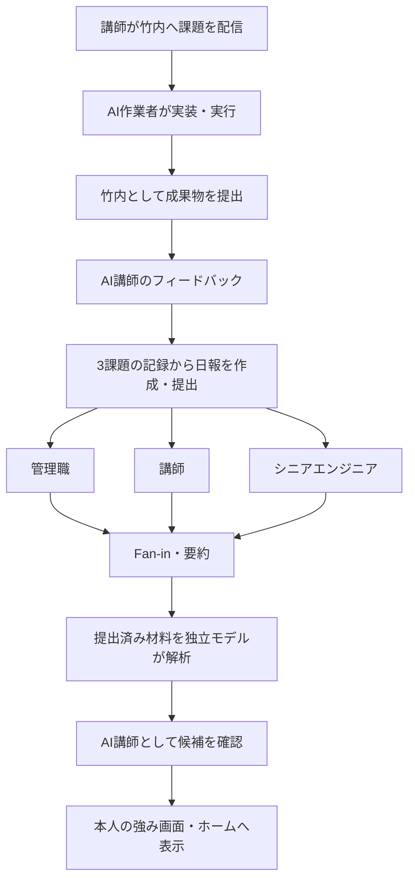
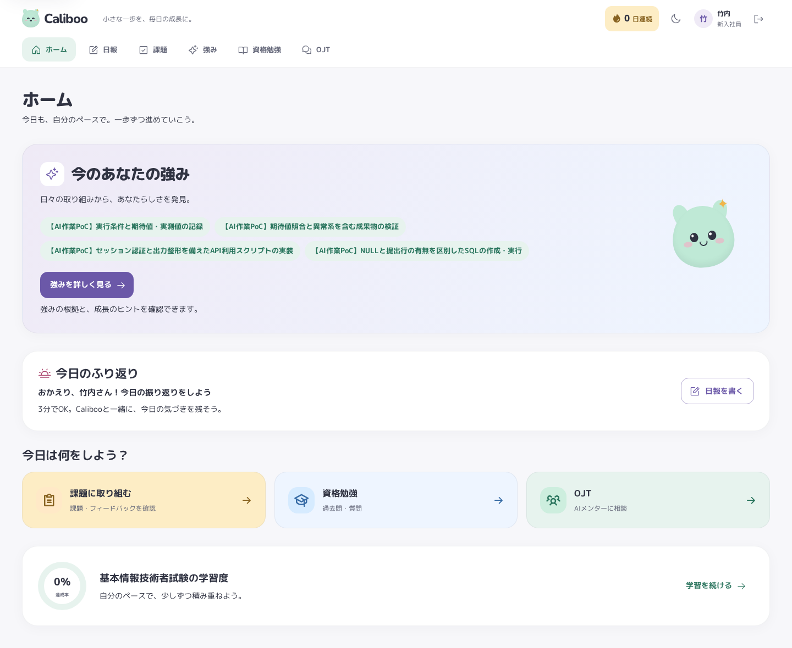

# 竹内・実作業による強み解析 PoC 成果報告

2026-09-29（日本時間）に、AIエージェントによる3件の実作業、課題提出、日報提出、3視点レビュー、Fan-in・要約、独立解析、講師確認、本人画面への可視化を完了した。

!NOTE: この文書の4候補・13引用・画面画像は初回実行時点の記録。能力と仕事上の性格傾向へ表示を改善した追加課題は、[追加実行の記録](../devel/poc_takeuchi/profile/README.md)を参照。現在の本人画面は追加解析・承認により更新される。

## 確認先

表示名は竹内、ログインIDは `takeuchi`。パスワードは依頼で指定された値を設定済み。アカウントIDは `5`、ロールは新入社員。

- [ホーム](http://localhost:5173/home): 実提出材料から得た強み4件。
- [強みと成長のヒント](http://localhost:5173/strengths): 4件の強み、13件の原文引用、次の取り組み。
- [日報](http://localhost:5173/report): 2026-09-29の提出済み日報。
- [課題一覧](http://localhost:5173/assignments): ID `4`・`5`・`6` が竹内宛て、すべてフィードバック済み。
- [PoC比較画面](http://localhost:5173/strengths/poc): 実行履歴 `run_0001：竹内・実作業PoC（3Dモデル／SQLite／Python）`。
- [3Dモデルの回転ビューア](http://localhost:5173/takeuchi-model.html): ドラッグ回転・ホイール拡縮。

作業ブランチは `feat/takeuchi-live-strength-poc`。成果物・実行記録は [devel/poc_takeuchi](../devel/poc_takeuchi/README.md) に保存。元から存在した未コミット変更は保持している。アカウントや提出結果は稼働中の `backend/var/caliboo.db` に永続化され、Git上の成果物とは別に保持される。

## 完了した実作業

| 課題 | 実際に作成・実行した内容 | 結果 |
| --- | --- | --- |
| 3Dモデル（課題4） | Python標準ライブラリでOBJ/MTLを生成し、Canvasへ同じメッシュを投影するビューアを実装 | 3,634頂点・7,216三角形。再読込、座標・面参照・退化面・マテリアル検証が成功 |
| SQLite演習（課題5） | メモリDBの4表、JOIN・集計・未提出抽出・NULLの扱い・外部キー・ROLLBACKを実行 | 独立した期待値と実測値が8/8項目で一致 |
| ユーザー一覧Python（課題6） | セッション認証で管理者APIを読み、6列を表/JSONで表示 | 実APIから竹内を含む5件を表示。誤認証401、一般ユーザーの権限不足403を確認 |

3Dビューアは追加の実画面確認で390px幅の横溢れが見つかり、`box-sizing: border-box` を適用して修正した。再検証では横溢れとJavaScriptエラーがなく、回転・拡縮で描画が変わることも確認した。

再実行手順は [モデル](../devel/poc_takeuchi/model/README.md)、[SQL](../devel/poc_takeuchi/sql/README.md)、[ユーザー一覧](../devel/poc_takeuchi/users/README.md) を参照。ユーザー一覧でいう「使用ユーザー」は登録アカウントであり、オンライン状態やセッション数ではない。

## 運用フローと記録

作業者は `gpt-6-sol`、形成的フィードバック・日報作成・3職種レビューも履歴を分離した `gpt-6-sol`、独立解析は `gpt-6-astra`。想定の強み・注入ペルソナは使用していない。3職種には日報だけを渡した。解析にタスクの `skillHint` や既存解析結果を渡していない。

!NOTE: 通常の日報APIには日報宛ての講師コメント保存口がないため、3視点の原文とFan-in要約は課題6のフィードバックに「日報・3課題全体のレビュー」と明記して保存した。これによって既存の実提出材料スナップショットへレビューと要約が入り、通常の強み解析へ接続できる。同じ3視点原文はPoC runにも保存している。

Fan-inは既存の `merge_reviews` による職種別原文の統合とフラグの重複排除を使用。要約は別の講師エージェントで生成し、原文を残して保存した。PoC取込後のFan-inと日報の `mentorComment` が一致することも確認した。

| 記録 | 識別子・結果 |
| --- | --- |
| 日報 | `rpt_20260929_6`、提出済み |
| 課題 | `4`・`5`・`6`、すべて `reviewed` |
| 通常の独立解析ジョブ | `9`、`completed`、竹内の未処理強みジョブ0件 |
| 強み候補 | `1`〜`4`、すべて `approved` |
| PoC比較run | `run_0001`、`external_codex`、`subjectId=user_5` |

## 本人画面に可視化した強み

通常の独立解析は提出されたSQL・Pythonの実装や実行結果を含む `strength-materials.v1` 全体を入力にした。13件の引用すべてが、引用可能な材料IDと原文の連続部分文字列に一致した。

| スキル | 表示する観測行動 | 解析の確信度 |
| --- | --- | --- |
| DBAD | NULLと提出行の有無を区別したSQLの作成・実行 | 94 |
| PROG | セッション認証と出力整形を備えたAPI利用スクリプトの実装 | 95 |
| TEST | 期待値照合と異常系を含む成果物の検証 | 96 |
| DOCM | 実行条件と期待値・実測値の記録 | 88 |

!NOTE: ユーザーのAI講師代替・可視化までの依頼に基づき、講師エージェントが4候補の表現と根拠を確認し、親エージェントが講師APIで承認した。ラベルにはすべて `【AI作業PoC】` を付けている。確信度はエージェントの出力値であり、人間の能力得点や校正済みの確率ではない。人間評価APIへの登録はしていない。

## PoC比較runの解析結果

PoC経路は3周の作業記録・日報・個別レビューを使い、同じ入力に対するルールベースと独立モデルを比較する。通常の解析ジョブ9とは入力の粒度が異なる。

| skillCode | ルールベース（判定 / 確信度） | 独立解析（判定 / 確信度） | 判定一致 |
| --- | --- | --- | --- |
| DBAD | confirmed / 0.85 | tentative / 0.73 | 不一致 |
| PROG | tentative / 0.60 | confirmed / 0.90 | 不一致 |
| TEST | 出力なし | confirmed / 0.94 | 不一致 |
| DOCM | insufficient_evidence / 0.35 | insufficient_evidence / 0.40 | 一致 |

独立モデルは小規模DB演習だけでDB管理全般を確定せず、複数成果物で繰り返した開発と検証を評価した。ルールベースではTESTが抽出されなかった。結果を一致させるための追記や書き換えはしていない。

PoC独立解析の初回出力は、未実施事項をTESTの引用根拠へ含めていた。独立モデルへ差し戻し、当該引用を根拠から除き限界欄へ移した。初回・差し戻し・修正後の出力を記録した。

通常のジョブ9ではSQL・実装・検証文書の本文も渡したため、文書について「実行条件と期待値・実測値の記録」という限定的な行動を根拠付きで抽出できた。PoCの記録要約だけから得たDOCMの保留判定と混同しない。

## 検証

| 対象 | 実測結果 |
| --- | --- |
| 3D生成・再読込 | 両配置のOBJ/MTLが有効、頂点・面数一致 |
| SQL演習 | 8/8項目一致、再実行可能 |
| CLI単体テスト | 3件成功 |
| CLI実API | 正常表示・401・403の3経路を確認 |
| 新規Pythonのflake8 | 指摘なし |
| frontend lint | 成功 |
| frontend既存テスト | 34ファイル・260件成功。statement/line 100%、branch 98.11%、function 99.23% |
| backend既存統合テスト | 一時SQLiteで46件成功。既存TestClientの非推奨警告1件 |
| 実ブラウザ | 本人ログイン、ホーム4件、強み13引用、390px幅、日報履歴、3視点・要約、PoC比較と根拠ダイアログを確認。JavaScriptエラー0件 |
| API最終照合 | 3課題reviewed・1日報・4承認済み候補・未処理強みジョブ0・ホーム一致 |

バックエンドの実装は今回変更していないため、バックエンド単体テスト全体の再実行は省略した。今回の成果物の検証と既存の統合テストを実行した。既存画面の挙動を変更していないため、総合テスト観点の新設はせず、既存の提出・解析・承認・表示観点に沿って実データで確認した。

## 証跡と範囲

- [実行の設定・モデルと適用方針](../devel/poc_takeuchi/trace/execution.json)
- [作業・講師フィードバックの3周記録](../devel/poc_takeuchi/trace/trajectory.json)
- [日報](../devel/poc_takeuchi/trace/diary.json)、[3視点レビュー](../devel/poc_takeuchi/trace/reviews.json)、[Fan-in](../devel/poc_takeuchi/trace/fan_in.json)、[要約](../devel/poc_takeuchi/trace/fan_in_summary.json)
- [通常解析への入力](../devel/poc_takeuchi/trace/live_analysis_input.json)、[生出力](../devel/poc_takeuchi/trace/live_analysis_result.json)、[候補の講師確認](../devel/poc_takeuchi/trace/candidate_trainer_review.json)
- [PoC取込ペイロード](../devel/poc_takeuchi/trace/poc_import_payload.json)、[保存結果](../devel/poc_takeuchi/trace/poc_run.json)
- [API最終照合](../devel/poc_takeuchi/trace/api_final.json)、[ブラウザ結果](../devel/poc_takeuchi/trace/browser_final.json)、[成果物SHA-256](../devel/poc_takeuchi/trace/artifact_manifest.json)

3DビューアはVite開発サーバーで参照する独立HTMLであり、既存ホームのマスコットは置換していない。Canvasの描画は三角形の深度ソートで、厳密な隠面処理や他の3Dツールでの読込は未検証。SQLは教材用メモリDB、CLIはローカルAPIを対象とする。

!NOTE: 今回達成したのはAIによる実作業を材料にした運用フローの成立と可視化であり、人間の竹内さんの能力・感情・成長を実測した結果ではない。実日報20件・人間2名による本番妥当性評価の実績には数えない。
